<div align="center">



<br/>

<a href="https://lenouvellouis.github.io/portfolio/">
  
</a>

<br/>

[](https://lenouvellouis.github.io/portfolio/)
[](https://www.linkedin.com/in/louis-lenouvel/)
[](mailto:mr.lenouvel.louis@gmail.com)

</div>

## ▸ About

ISEP graduate (class of 2026). I spent three years as a data engineer at [**IKIGAI, Games for Citizens**](https://www.gfc.ikigai.games/), keeping data pipelines running in production: xAPI migrations over millions of statements, FastAPI services, Docker, CI/CD, PostgreSQL.

These days I mostly work on machine learning and GenAI, with the same obsession: it should still work six months from now. Self-hosted RAG, MLOps scaffolding, ELT pipelines, and a few side projects that are just for fun.

```python
class Louis:
    role      = "Data & ML Engineer"
    based_in  = "Paris, FR"
    shipped   = "3 years of production data pipelines @ IKIGAI"
    focus     = ["GenAI / RAG", "MLOps", "Data pipelines", "Applied ML"]
    speaks    = ["FR", "EN"]
```

## ▸ Prochains départs · Next departures

Every project is a metro line. The right column updates live from each repo.

| Line | Project | What it does | Stack | Live |
|:---:|---|---|---|---|
|  | [**Sovereign RAG**](https://lenouvellouis.github.io/portfolio/#/projets/sovereign-rag) | Ask questions to PDFs, 100% local: hybrid search, reranking, sentence-level citations, prompt-injection and PII guards | Ollama · Mistral 7B · ChromaDB · FastAPI |  |
|  | [**Undercurrents**](https://github.com/LenouvelLouis/Undercurrents) | 18 years of Tame Impala setlists (~750 shows): clustering, song-appearance prediction, psychedelic vinyl UI | FastAPI · SQLite · React · Vite |  |
|  | [**Vélib' Agent**](https://github.com/LenouvelLouis/velib-agent-go) | French conversational agent on Paris Vélib' stations, SSE streaming, swappable LLM provider | Go · trpc-agent-go · PostgreSQL · Ollama |  |
|  | [**FlowForge**](https://github.com/LenouvelLouis/FlowForge) | Modern ELT pipeline on SNCF railway data, fully local via Docker Compose *(in progress)* | Airflow · dbt · PostgreSQL · Docker |  |
|  | [**MetroVision MLOps**](https://github.com/LenouvelLouis/MetroVision-MLOps) | Industrialising a Paris Metro pictogram detector: serving, registry, drift monitoring | FastAPI · Kubernetes · MLflow · Prometheus · Evidently |  |
|  | [**PowerShift**](https://github.com/LenouvelLouis/PowerShift) | Energy grid simulation with PyPSA optimal power flow and real KNMI weather data | PyPSA · FastAPI · React |  |
|  | [**DeepRetriev**](https://github.com/LenouvelLouis/DeepRetriev) | From-scratch RAG pipeline, every component explicit, no LangChain | sentence-transformers · ChromaDB · Ollama |  |

<sub>Full map with every station: [lenouvellouis.github.io/portfolio](https://lenouvellouis.github.io/portfolio/)</sub>

## ▸ Stack

<div align="center">

<br/>
<br/>


<br/>


</div>

## ▸ Live traffic

<div align="center">
  
  
  <br/>
  
</div>

<br/>

<picture>
  <source media="(prefers-color-scheme: dark)" srcset="https://raw.githubusercontent.com/LenouvelLouis/LenouvelLouis/output/snake-dark.svg" />
  <source media="(prefers-color-scheme: light)" srcset="https://raw.githubusercontent.com/LenouvelLouis/LenouvelLouis/output/snake-light.svg" />
  
</picture>

## ▸ Last stations served

<!--START_SECTION:activity-->
<!--END_SECTION:activity-->

<div align="center">

<br/>


</div>
